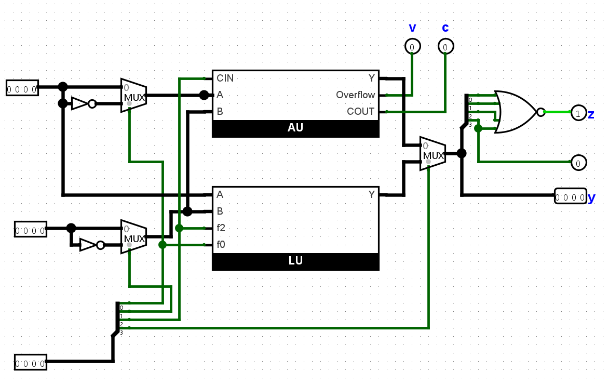
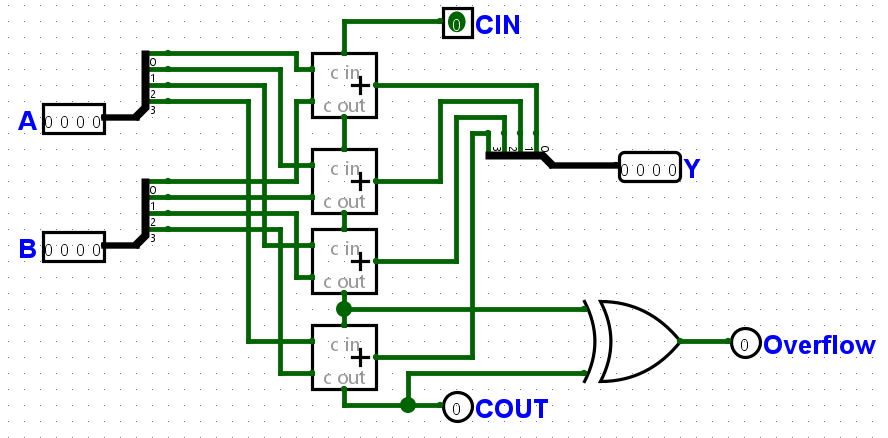
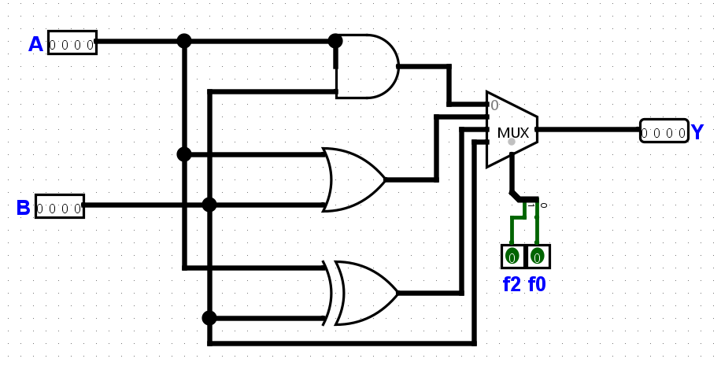

# 4-bit Arithmetic Logic Unit (ALU) using Logisim Evolution

A modular **4-bit Arithmetic Logic Unit (ALU)** designed using **Logisim Evolution**. This project integrates separate Arithmetic and Logic Units to perform arithmetic and logical operations with **carry generation** and **overflow detection**, demonstrating fundamental concepts of Digital Electronics and Computer Architecture.

---

# Project Preview

## Main ALU



---

## Arithmetic Unit



---

## Logic Unit



---

# Simulation Demo

🎥 **Project Simulation**

[▶ Watch / Download Simulation](images/simulation.mp4)

---

# Overview

This project implements a **4-bit Arithmetic Logic Unit (ALU)** capable of performing arithmetic and logical operations on two 4-bit binary inputs.

The design follows a **modular architecture**, where the Arithmetic Unit and Logic Unit are developed independently and integrated using multiplexers for operation selection.

The Arithmetic Unit performs binary addition and subtraction using cascaded Full Adders, while the Logic Unit performs common bitwise logical operations. The circuit also generates Carry-Out and Overflow flags, closely resembling the architecture of a basic processor ALU.

---

# Features

- 4-bit Arithmetic Logic Unit (ALU)
- Modular Arithmetic Unit
- Modular Logic Unit
- Binary Addition
- Binary Subtraction (Two's Complement)
- Bitwise AND
- Bitwise OR
- Bitwise XOR
- Multiplexer-Based Operation Selection
- Carry-Out Generation
- Overflow Detection
- Modular Digital Circuit Design
- Designed using Logisim Evolution

---

# Components Used

- Logisim Evolution
- Full Adders
- Multiplexers (MUX)
- AND Gates
- OR Gates
- XOR Gates
- NOT Gates
- Input Pins
- Output Pins

---

# Inputs

| Input | Description |
|--------|-------------|
| A | 4-bit Operand A |
| B | 4-bit Operand B |
| Cin | Carry Input |
| F1 | Function Select Bit |
| F0 | Function Select Bit |

---

# Outputs

| Output | Description |
|---------|-------------|
| Y | 4-bit Output Result |
| Cout | Carry-Out |
| Overflow | Overflow Flag |

---

# Working Principle

## Arithmetic Unit

The Arithmetic Unit is implemented using four cascaded Full Adders configured as a Ripple Carry Adder.

It performs:

- Binary Addition
- Binary Subtraction using Two's Complement
- Carry-Out Generation
- Overflow Detection

---

## Logic Unit

The Logic Unit performs bitwise logical operations on the two input operands.

Supported operations include:

- AND
- OR
- XOR

A multiplexer selects the desired logical operation based on the function select inputs.

---

## ALU

The outputs of the Arithmetic Unit and Logic Unit are connected to a final multiplexer.

Depending on the control signals, the ALU produces the required arithmetic or logical result while simultaneously generating Carry-Out and Overflow flags.

---

# Operations Supported

| Category | Operation |
|----------|-----------|
| Arithmetic | Addition |
| Arithmetic | Subtraction |
| Logic | AND |
| Logic | OR |
| Logic | XOR |

---

# Repository Structure

```
4-bit-Arithmetic-Logic-Unit
│
├── code
│   └── ALU_Project.circ
│
├── images
│   ├── main_alu.png
│   ├── arithmetic_unit.png
│   ├── logic_unit.png
│   └── simulation.mp4
│
├── README.md
│
└── LICENSE
```

---

# Skills Demonstrated

- Digital Logic Design
- Arithmetic Logic Unit (ALU) Design
- Combinational Circuit Design
- Ripple Carry Adder Design
- Two's Complement Arithmetic
- Multiplexer Design
- Overflow Detection
- Computer Architecture
- Digital Circuit Simulation
- Logisim Evolution

---

# Applications

- Processor Design
- CPU Architecture
- Embedded Systems
- FPGA Learning
- Digital Electronics Education
- Computer Organization & Architecture
- Engineering Laboratory Demonstrations

---

# Future Improvements

- 8-bit ALU Design
- NAND Operation
- NOR Operation
- XNOR Operation
- Shift Left
- Shift Right
- Zero Flag
- Negative Flag
- Comparator Circuit
- FPGA Implementation using Verilog/VHDL

---

# Learning Outcomes

This project strengthened my understanding of:

- Modular digital circuit design
- Arithmetic and logical circuit implementation
- Ripple Carry Adder architecture
- Two's Complement arithmetic
- Overflow detection techniques
- Multiplexer-based operation selection
- Digital circuit simulation using Logisim Evolution
- Fundamental processor architecture concepts

---

# License

This project is licensed under the **MIT License**.
